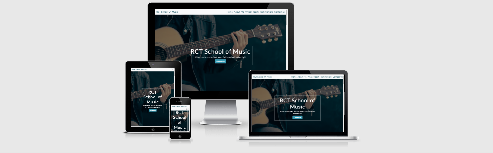

# RCT School of Music

[View the live project here](https://andywales83.github.io/MS-Project-1/)

---

## Contents

- [Project Description](#project-description)
- [UX Design](#ux-design)
- [Features](#features)
- [Technologies Used](#technologies-used)
- [Testing](#testing)
- [Deployment](#deployment)
- [Credits](#credits)

---

## Project Description   

RCT School of Music is a fictional website for a music school in my home town, in South Wales. The website will primarily be aimed more at general customers, however it will still need a professional look and design, along with the incorporation of user friendly but professional looking features. Features included are an overview of the tutor and their professional background, a list of the different instruments to which tutoring is being offered, an opportunity to read testimonials from current or previous learners, a clear indication of the prices and an opportunity to book a lesson or ask any questions in advance, via a contact form.

Being a musician myself, I appreciate how dificult it often is as a beginner, to find local tutors in the area, who have websites that fully detail what they offer, in a structured and comprehensive manner. This website is built with the hopes of aspiring students, having a valuable resource at hand, where they can access details of the instruments taught, the styles of music taught, how the lessons can be delivered and enough details about the tutor and their background, to encourage an informed decision to book a lesson

---

## UX Design

## Strategy 

### User Stories
- #### First Time Visitor Goals

    1. As a first time visitor, I want to be able to quickly understand the purpose of the website.
    2. As a first time visitor, I want to be able to easily navigate the site, with access to the necessary content being clear and direct.
    3. As a first time visitor, I want to be able to read and review current or previous learner testimonials, to help aid my decision to sign-up.

- #### Returning Visitor Goals

    1. As a returning visitor, I want to be able to email the company/tutor to enquire about booking a lesson and/or ask questions.
    2. As a returning visitor, I want to be able to fully understand what is being offered by the website, in terms of the musical instruments being taught, the levels, the styles, who the tutor os and the costs.
    3. As a returning visitor, I would want to find links to the company's social media platforms where I could review their following and any additional testimonials and feedback they have gained online.

- #### Frequent User Goals

    1. As a frequent user, I want to be able to see any new offers introduced on bookings.
    2. As a frequent user, I want to be able to see if there are any opportunities coming up, to learn a new instument or style.
    3. As a frequent user, I want to be able to book a lesson directly through the website using an incorporated calendar.
    4. As a frequent user, I want to be able to register for a newsletter that may provide information on upcoming offers, as well as updates to the site or to the business.

## Scope

### What a user may expect
- Based on the aformentioned user stories, the aim of building the website, is to give users an easy to navigate website, which is visually appealing and well presented across all possible display sizes. All sections of the site should be clearly labelled where required, and all links to each section should work appropriately. The site should provide a clear and distinguishable way, for users to see feedback, to connect with the business via social media and be able to easily reach out to the business with any questions.

### What I expect as a business 
- As a business, I would expect to provide a user of the site, with clear information about the School. I would expect a user to be able to easily associate with the tutor of the site and with previous students. I would expect a user to be encouraged to make contact with the school, wherever possible and to be provided with a quick and convenient way to do so. I would also expect a user to be able to quickly navigate around the site.

## Structure
- The website will be built over seven different sections.
    1. A Navigation bar for inclusion of the brand name and the site navigation links.
    2. A Hero Image which will be the main point of the home screen. In the center of the Hero Image will be a text box with a large title and a button to encourage the user to make contact.
    3. A section about me, that details background and experience, as well as a profile picture of myslef, to allow for user assocaiation.
    4. A "What I Teach" section that will outline the instruments and musical styles that are taught, as well as the price rate for lessons.
    5. A testimonials section where users can quickly find examples of student feedback.
    6. A contact form allowing the user to make contact regarding any queries they may have, or any instruments that they would like to book in lessons for.
    7. The footer. This will be for linking the social media pages for the business and providing copyright details.

## Features

- ### Existing Features

- **Navigation Bar**
    - Featured at the top of the main home screen, the navigation bar has been coded to remain in place and does not move with the screen as the user scrolls. The navigation bar is fully responsive and structured to show the logo for the site, as well as links to the About Me, Teachings, Testimonials and Contact Form Sections.
    - The navigation bar also incorprates Bootstrap 5's version of the navbar toggler, that breaks the navbar down and hides it behind the toggler at the medium breakpoint of responsiveness.

    

- Hero Image Section
    - The hero image section was designed with the idea of really influencing a user to find out more about the service. The large image of somebody holding an Acoustic Guitar was selected, to really highlight visually, the dynamic of what the site is all about. 
    - Centered in the middle of the Hero Image is a text box, that was again incorporated to really spark an interest in the service and influence a user to want to find out more. The text box was designed with the larger logo, the leading paragraph "Where you can unlock your full musical potential!" and the Contact Us! button to really draw in that initial focus of a user and instantly encourage them to make contact.

    

- About Me Section
    - The About Me section was created to instantly give the user a sense of association with the school's tutor. The image chosen for the tutor, was done so with the view to keeping the About Me scetion consistent with a professional but welcoming feel. 
    - The written content of the About Me section, was again written with the view to providing a professional but welcoming background, to the tutors musical experience and qualifications that could have a great influence on a potential customer, chosing to use the school's services for their musical learning.

    

- What I Teach Section
    - This section of the website, was built to highlight what is taught at the school. The visuals were chosen, so that a site visitor would be able to quickly identify what instruments they can learn, even if there was no textual representation of the offering.
    - The card style desings allowed for sufficient space, to add content relating to the cost of tutoring, and what styles of music a learner can choose to learn from.    

<!-- Space for the image of the What I Testimonials section -->

- Testimonials Section
    - The tesimonials section was developed, to allow users to gain insight in to the thoughts of other students, and hopefully encourage a potential customer to contact the School.
    - The section contains three sets of feedback quotes at its largest and smallest screen sizes, with one being hidden at the medium screen size for a better overall look at medium screen widths.

    

<!-- Space for the image of the Contact Form -->

- Contact Form Section

    

<!-- Space for the image of the Footer -->

- Footer Section
    - The footer section was created to be visually simplistic, yet allow sufficient space for additional content to be added in future updates. Content such as a signup link for a newsletter, or links to blog sections, giving additional benefit to returning users or first time visitors.
    - The footer provides a user with the links needed to reach out and connect with the School via social media as well as the copyright information for the website

    
### Features to implement in the future

There are multiple updates that could be implemented in the future, that would add additional user benefit and would fall in line, with the scope of the goals to increase the features for frequent users.

- Implemented features could include:
    - implementation of a direct to source calendar booking system such as calendly, where learners can directly access the calendar for teh tutor, and book in a slot for a lesson from a pre-set number of days and times.
    - implementation of an alert bar, that gives users information on details such as new instruments that are being introduced to the offering. Offers that can be accessed, such as referral rates for friends and family, or reduced lesson prices through blocked bookings.
    - implementation of a new section or page that allows the tutor to create an online blog, introducing snippets of lessons, musical techniques or ideas and concepts.
    - A frequently asked questions page, where the most common questions asked by students are answered, giving potential customer a greater depth of readily available information.    
    - introduction of a monthly subscription where students can access a subscription only area with video and tutorials and downloadable content. 

## Technologies Used

- This project uses the core programming languages of HTML5 and CSS3.

- Github 
    - The project uses Github as the main repository storage space for this website
    - An extension of Github, Gitpod was used as the main development platform when building the site and all development stages were committed to Git and pushed to Github accordingly.
    - Github Pages is then used to host a live version of the webpage following the deployment process outlined below.

- Bootstrap 5 
    - Bootstrap 5 was used to help create a simplified way of controlling the overall responsiveness of the site.
    - Bootstrap was also used to implement design features such as the nav bartoggler, cards, contact form styling and the footer.

- Google Fonts
    - The project uses imported font families from the Google Font platform.

- Balsamiq 
    - The balsamiq platform was used for creation of the wireframe designs.

## Testing

### Validator testing

- HTML
    - All HTML Code was passed through the official W3C Validator, with th ereport returning no errors. [W3C HTML Validator](https://validator.w3.org/nu/?doc=https%3A%2F%2Fandywales83.github.io%2FMS-Project-1%2F)

- CSS
    - Whilst the website was created using the Bootstrap 5 library, testing of the CSS on the live site creates errors due to the unrecognised base styling for Bootstrap. Direct testing of the site's css file, via direct input, shows no errors being reported. [W3C CSS Validator](Documentation/readme-images/website-css-validation.png)
    

## Deployment

This project has been created using the Gitpod IDE. Through numerous occasions, the project development has been pushed to Git and Committed in full, to Github. This has been carried out using the built in fuction of Gitpod

For live viewing on Github Pages, the project was deployed using the following method:

    - Log in to Github.
    - Select the required Github repository.
    - Make sure that the repository is on the Master branch.
    - Clicking on the Settings tab from the menu listed under the repository name.
    - Selecting the Pages tab from the Settings menu, that is listed down the left side of the screen.
    - Clicking on the button under the sources section labeled None and selecting Master Branch
    - Clicking on the save button, to activate the deployment to Github Pages. 

## Credits

